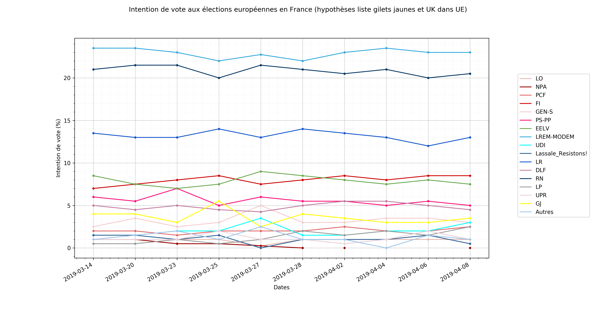

# Élections eruopéennes 2019 en France
Aggrégation de sondages et graphiques à propos des élections européennes ayant lieu en mai 2019 en France.
Hypothèses : liste Gilets Jaunes, UK encore dans l'UE (donc 74 sièges attribuables à la France).

N'hésitez pas à contribuer à ce projet, en améliorant le code et les graphqiques, ou en ajoutant les sondages au fichier .csv au fur et à mesure.

## Intention de vote
Mise à jour 2019-04-10

## Nombre de sièges obtenus
Mise à jour 2019-04-10

### Sources
[Rolling Ifop](https://dataviz.ifop.com/IFOP_ROLLING_EUROPE/TELECHARGEMENT/IFOP_EURO-ROLLING_2019-04-08.pdf)

[Baromètre Harris Interactive](https://harris-interactive.fr/opinion_polls/barometre-des-elections-europeennes-le-pouls-de-la-campagne-vague-4/)

[Wikipédia](https://fr.wikipedia.org/wiki/Sondages_sur_les_élections_européennes_de_2019#France)

[Vie-publique.fr](https://www.vie-publique.fr/actualite/faq-citoyens/elections-europeennes-2019/)

[Vie-publique.fr](https://www.vie-publique.fr/actualite/panorama/texte-discussion/projet-loi-relatif-election-representants-au-parlement-europen.html)
