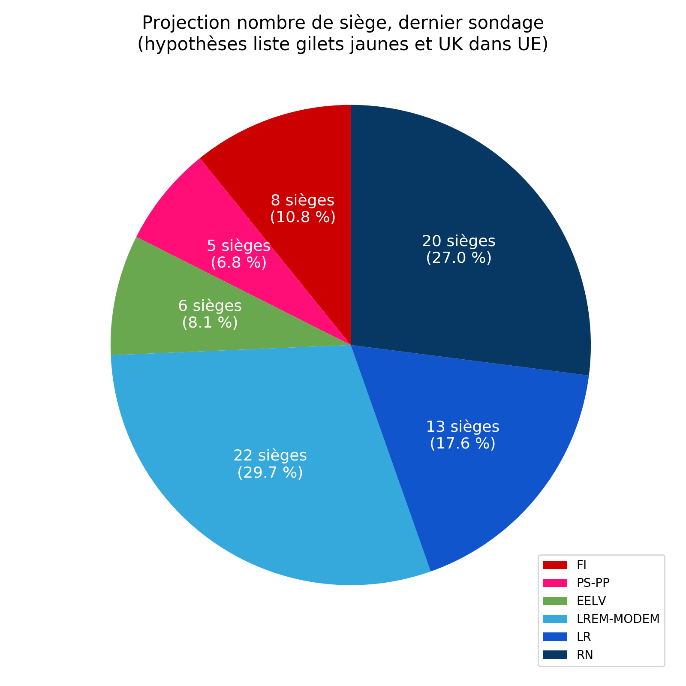

# Élections européennes 2019 en France
## Introduction
Ce projet a d'abord pour but d'aggréger les sondages d'intention de vote aux élections européennes ayant lieu en mai 2019 en France. Mais il a aussi pour but de fournir un algorithme de calcul de répartition des sièges aux partis poltiiques suivant leur résultat aux élections.

Hypothèses : 
1. présence d'une liste Gilets Jaunes,
2. le Royaume-Uni organise des élections européennes, et donc la France ne dispose que de 74 sièges.

N'hésitez pas à contribuer à ce projet, en améliorant le code, ou en ajoutant des sondages au fichier `Sondages/Sondages_hyp_GJ.csv` au fur et à mesure.

Les sondages proviennent des principaux institus français, dont Harris Interactive et Ifop (voir section *Sources*).

## Résultats
### Intention de vote
Mise à jour 2019-04-10

Intention de vote des électeurs français aux élections européennes de 2019.

### Nombre de sièges obtenus
Mise à jour 2019-04-10

Mode de scrutin :
> "La loi du 25 juin 2018 relative à l’élection des représentants au Parlement européen rétablit une circonscription unique qui était déjà en vigueur avant les élections de 2004 (pour les élections de 2004 et de 2009, le territoire était découpé en 8 circonscriptions régionales, 7 pour la métropole, 1 pour l’outre-mer).
> Les élections européennes ont lieu au suffrage universel direct à un tour. Les candidats sont élus pour cinq ans selon les règles de la représentation proportionnelle à scrutin de liste à la plus forte moyenne. Les partis ayant obtenu plus de 5% des suffrages bénéficient d’un nombre de sièges proportionnel à leur nombre de voix." 
[Source](https://www.vie-publique.fr/actualite/faq-citoyens/elections-europeennes-2019/#art15058)

## 
### Légende

| Initiales | Parti politique | Initiales | Parti politique |
|---|---|---|---|
| LO | Lutte Ouvrière | R! | Resistons! |
| NPA | Nouveau Parti Anticapitaliste | LR | Les Républicains |
| PCF | Parti Communiste Français | DLF | Debout La France |
| FI | France Insoumise | RN | Rassemblement National |
| GEN-S | Génération•s | LP | Les Patriotes |
| PS-PP | Parti Socialiste - Place Publique| UPR | Union Populaire Républicaine |
| EELV | Europe Écologie Les Verts | GJ | Gilets Jaunes |
| LREM-MODEM | La République en Marche et ses alliés | Autres | Autres |
| UDI| Union des Démocrates et Indépendants | | |

### Sources
[Rolling Ifop](https://dataviz.ifop.com/IFOP_ROLLING_EUROPE/TELECHARGEMENT/IFOP_EURO-ROLLING_2019-04-08.pdf)

[Baromètre Harris Interactive](https://harris-interactive.fr/opinion_polls/barometre-des-elections-europeennes-le-pouls-de-la-campagne-vague-4/)

[Wikipédia](https://fr.wikipedia.org/wiki/Sondages_sur_les_élections_européennes_de_2019#France)

[Vie-publique.fr](https://www.vie-publique.fr/actualite/faq-citoyens/elections-europeennes-2019/)

[Vie-publique.fr](https://www.vie-publique.fr/actualite/panorama/texte-discussion/projet-loi-relatif-election-representants-au-parlement-europen.html)
